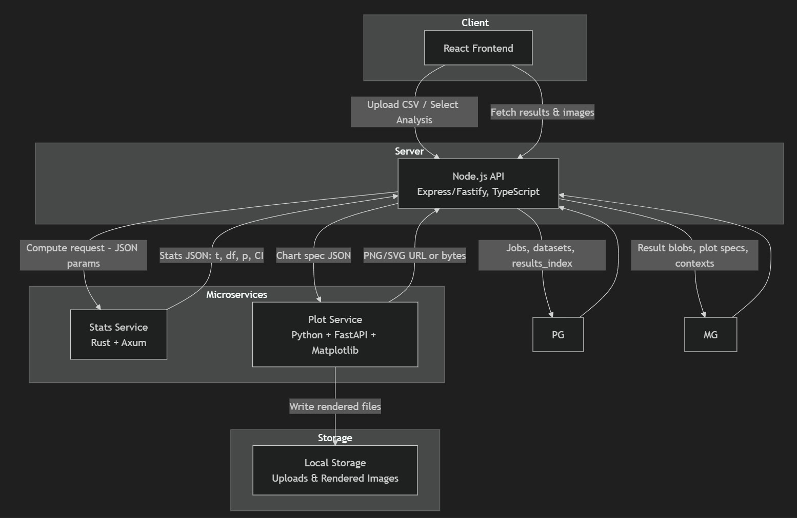

# Stats Utility App

A containerized statistics app with a React frontend, Node backend, and Rust/Python microservices for computation and plotting.




## Features

- Upload CSV files and run common statistical tests (t-test, ANOVA, OLS, etc.)
- Automatically generate APA-style summaries and publication-ready visualizations
- Modular microservices design:
  - 🦀 **Rust** → high-performance statistical kernels
  - 🐍 **Python** → plotting and rendering via FastAPI + matplotlib
- Full orchestration through **Docker Compose**

---

## Architecture

The app follows a simple pipeline:
React (frontend)
↓
Node.js (backend)
↓
Rust (stats microservice)
↓
Python (plotting microservice)

For a deeper look, see the full [Architecture Details](./docs/architecture.md).

## Quick Start

```bash
docker compose up --build
```

## Repository Layout

Visit: `http://localhost:8080`

| Folder                  | Description                       |
| ----------------------- | --------------------------------- |
| `apps/frontend`         | React (Vite + Tailwind)           |
| `apps/backend`          | Node.js (Express/Fastify)         |
| `apps/stats_rs`         | Rust service (Axum)               |
| `apps/plots_py`         | Python FastAPI matplotlib service |
| `packages/shared-types` | Shared Zod/TypeScript schemas     |
| `docker/`               | Dockerfiles and Compose configs   |

## Documentation

[Architecture Details](./docs/architecture.md)

[Stats Service - Rust](./docs/stats_rs.md)

[Plot Service - Python](./docs/plots_py.md)

[Database](./docs/database.md)

[Docker](./docs/docker.md)

[Frontend](./docs/frontend.md)

[Backend](./docs/backend.md)

## Tech Stack

- Frontend: React, Vite, Tailwind CSS, shadcn/ui
- Backend: Node.js (Express or Fastify), TypeScript
- Microservices: Rust (Axum) + Python (FastAPI, Matplotlib)
- Data Storage: PostgreSQL + MongoDB
- Containerization: Docker & Docker Compose

## Development Notes

- Run individual services locally (cargo run, npm run dev, etc.)
- `.env` files are separated for Docker vs. app runtime
- Use docker compose config to validate all env vars are resolved

## License

[MIT © 2025 Steven Wallace](./LICENSE)
