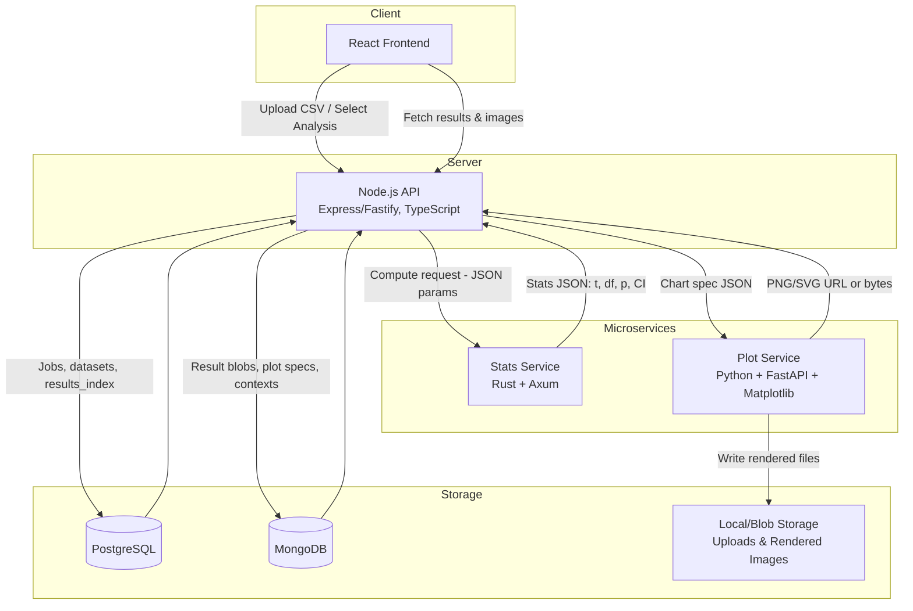

# Architecture

The Stats Utility App is a modular, containerized system for running and visualizing statistical analyses.
It follows a React → Node.js → Rust/Python pipeline, orchestrated through Docker Compose.

## Overview



Each layer has a clear responsibility boundary:

| Layer              | Responsibilities                                          | Tech Stack                             |
| ------------------ | --------------------------------------------------------- | -------------------------------------- |
| **Frontend**       | Upload CSVs, choose analyses, preview results, view plots | React + Vite + Tailwind + shadcn/ui    |
| **Backend**        | Job orchestration, data persistence, service integration  | Node.js (Express/Fastify + TypeScript) |
| **Rust Service**   | High-performance numeric/statistical computations         | Rust + Axum                            |
| **Python Service** | Plot rendering, visual output (PNG/SVG)                   | Python + FastAPI + Matplotlib          |

## Data Flow

1. Upload – The user uploads a CSV via the frontend.
   The backend saves it, infers schema, and returns a `datasetId`.

2. Analysis Selection – The user selects an analysis (e.g., t-test).
   The backend calls the Rust service, passing column names and parameters.

3. Computation – Rust returns deterministic JSON results (e.g., t, df, p, CI).
   The backend logs metadata and creates a summary for the frontend.

4. Visualization – The backend constructs a chart spec and sends it to the Python service,
   which renders and returns a PNG/SVG.

5. Display & Export – The frontend displays both the numeric output and visualization,
   allowing the user to export Markdown or image reports.

## Service Boundaries

### Stats Engine (Rust)

- Purely computational — no I/O beyond structured JSON.
- Deterministic outputs for testing and reproducibility.
- Core algorithms:
  - Descriptives (mean, sd, ci95)
  - Hypothesis tests (t-test, ANOVA, chi-square)
  - Regression (OLS, simple linear)
- Validates inputs and handles missing values safely.

### Plot Renderer (Python)

- Accepts normalized “chart spec” JSON from Node.
- Uses `matplotlib` for reproducible academic-style plots.
- Returns either file URL or raw bytes.
- Caches rendered images by SHA256(spec JSON).

### Orchestrator Backend (Node.js)

- Central controller that:
  - Handles REST requests from the frontend.
  - Manages dataset/job lifecycle in Postgres/Mongo.
  - Invokes Rust and Python services with timeouts/retries.
  - Builds Markdown summaries and exportable artifacts.

### Frontend (React UI)

- Progressive web UI for:
  - Data upload & variable selection.
  - Analysis wizard flow.
  - Interactive result display (APA tables + chart).
- Built with Vite, Tailwind, and shadcn/ui.

## Deployment Model

- Docker Compose defines all containers and shared networks.
  Example composition:

```yaml
services:
  frontend:
    build: ./apps/frontend
    ports: ["3000:3000"]
  backend:
    build: ./apps/backend
    ports: ["8080:8080"]
    depends_on: [stats_rs, plots_py]
  stats_rs:
    build: ./apps/stats_rs
    ports: ["9000:9000"]
  plots_py:
    build: ./apps/plots_py
    ports: ["7000:7000"]
```

- Local volumes store uploaded CSVs and rendered charts.
- Health checks ensure all services are online before orchestration begins.

## Future Extensions

- Add job queue (Redis/Kafka) for async computations.
- Expand Rust service to multi-variate regression and bootstrap CI.
- Extend Python renderer with Seaborn or Plotly export modes.
- Add report generation pipeline (Markdown → DOCX/PDF).
